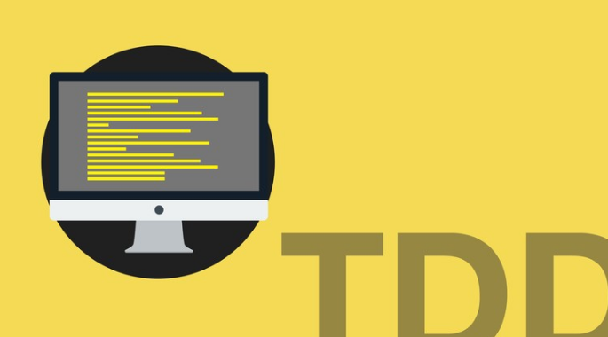

<h1 align="center">
  <br>
  <a href="http://linkedin.com/devfabiocicero"></a>
  <br>
  JS TDD Boilerplate
  <br>
</h1>

<h4 align="center">JS TDD Boilerplate</h4>

<p align="center">
  <a href="#how-to-use">How To Use</a> •
  <a href="#license">License</a>
</p>

## How To Use

To clone and run this application, you'll need [Git](https://git-scm.com) and [Node.js](https://nodejs.org/en/download/) (which comes with [npm](http://npmjs.com)) installed on your computer. From your command line:

```bash
# Clone this repository
$ git clone https://github.com/devfabiocicero/js-tdd-boilerplate

# Go into the repository
$ cd js-tdd-boilerplate

# Install dependencies
$ npm install

# Run the app
$ npm start
```

Note: If you're using Linux Bash for Windows, [see this guide](https://www.howtogeek.com/261575/how-to-run-graphical-linux-desktop-applications-from-windows-10s-bash-shell/) or use `node` from the command prompt.

## License

MIT

---

> Linkedin [@devfabiocicero](http://linkedin.com/devfabiocicero) &nbsp;&middot;&nbsp;
> GitHub [@devfabiocicero](https://github.com/devfabiocicero) &nbsp;&middot;&nbsp;
